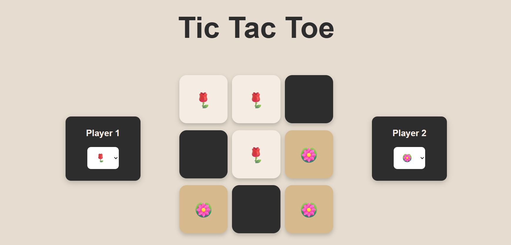
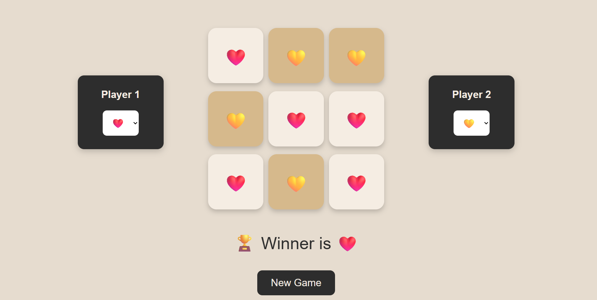

# Tic Tac Toe Game

## 🎮 About The Project

Elegant Tic Tac Toe is a modern and interactive web-based game developed using HTML, Tailwind CSS, and JavaScript. The project transforms the classic Tic Tac Toe experience into a visually appealing and responsive game with a premium beige and dark-grey user interface.

The game allows two players to compete with customizable icons instead of traditional X and O symbols. Players can choose from different emoji categories such as flowers, animals, food, gaming icons, and more, making the gameplay more fun and personalized.

The interface is fully responsive and works smoothly on desktops, tablets, and mobile devices. Smooth hover animations, modern buttons, rounded game boxes, and elegant color combinations create a clean and attractive user experience.


## ✨ Key Features

🎨 Elegant Beige & Dark Grey UI
📱 Fully Responsive Design
🎭 Custom Icon Selection for Players
⚡ Smooth Hover Animations
🏆 Winner Announcement System
🔄 Reset & New Game Functionality
💻 Built with Tailwind CSS
🎮 Interactive Gameplay Experience


## ✨ Tach Stack 


## ✨ ScreenShorts
<p align="center">
  
  
</p>


## 📂 Folder Structure
```text
│
├── index.html
├── style.css
├── script.js
```